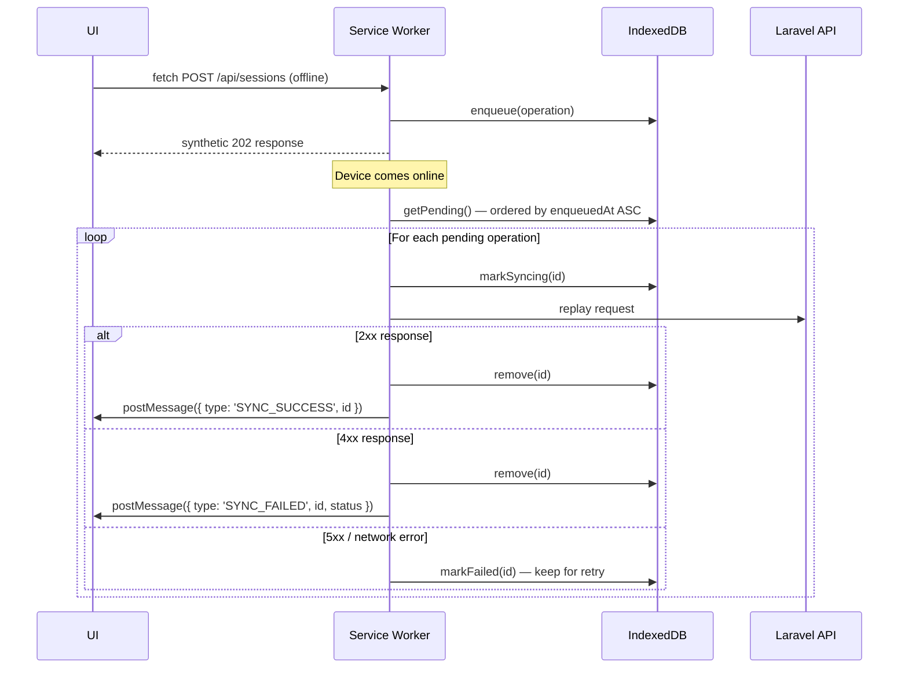

# Design Document: PWA + i18n (SpaCashier & SpaBooking)

## Overview

This document describes the technical design for making both **SpaCashier** (Next.js 16 / React 19) and **SpaBooking** (Nuxt 3 / Vue 3) offline-first Progressive Web Apps with full English/Indonesian internationalization.

The two apps share the same conceptual architecture but use different framework-specific libraries:

| Concern | SpaCashier | SpaBooking |
|---|---|---|
| PWA | `@ducanh2912/next-pwa` + Workbox | `@vite-pwa/nuxt` + Workbox |
| i18n | `next-intl` | `@nuxtjs/i18n` |
| Offline queue | Custom IndexedDB + Workbox BackgroundSync | Custom IndexedDB + Workbox BackgroundSync |
| State | React Context + hooks | Pinia stores + composables |
| Testing | Vitest + `@testing-library/react` + `fast-check` | Vitest + `@testing-library/vue` + `fast-check` |

The Laravel backend gains an `AI_Translation_Service` that wraps OpenAI to translate AI-generated content at request time.

---

## Architecture

```mermaid
graph TB
    subgraph Browser
        subgraph SpaCashier["SpaCashier (Next.js 16)"]
            SC_UI[React UI]
            SC_SW[Service Worker\n@ducanh2912/next-pwa]
            SC_IDB[(IndexedDB\nOffline Queue)]
            SC_CS[(Cache Storage\nApp Shell + API)]
            SC_I18N[next-intl\nTranslation Catalogs]
        end

        subgraph SpaBooking["SpaBooking (Nuxt 3)"]
            SB_UI[Vue UI]
            SB_SW[Service Worker\n@vite-pwa/nuxt]
            SB_IDB[(IndexedDB\nOffline Queue)]
            SB_CS[(Cache Storage\nApp Shell + API)]
            SB_I18N[@nuxtjs/i18n\nTranslation Catalogs]
        end
    end

    subgraph Backend["Laravel API"]
        API[REST API]
        ATS[AI Translation Service\nOpenAI wrapper]
        AI_GEN[AI Generation\nOpenAI]
    end

    SC_UI -->|fetch| SC_SW
    SC_SW -->|cache hit| SC_CS
    SC_SW -->|offline write| SC_IDB
    SC_SW -->|online replay| API
    SC_SW -->|GET| API

    SB_UI -->|fetch| SB_SW
    SB_SW -->|cache hit| SB_CS
    SB_SW -->|offline write| SB_IDB
    SB_SW -->|online replay| API
    SB_SW -->|GET| API

    API --> AI_GEN
    AI_GEN -->|English content| ATS
    ATS -->|translated content| API
```

### Key Design Decisions

1. **Workbox via framework plugins** — Both `@ducanh2912/next-pwa` and `@vite-pwa/nuxt` wrap Workbox, so caching strategies are declared in config rather than hand-written SW code. This keeps the SW maintainable and avoids duplicating Workbox boilerplate.

2. **Custom IndexedDB queue over Workbox BackgroundSync API** — The native Background Sync API has limited browser support and no retry control. A custom IndexedDB queue gives us full control over ordering, retry logic, error handling, and UI feedback (pending count, per-item status).

3. **Translation catalogs precached** — Both `en` and `id` JSON catalogs are added to the Workbox precache manifest so locale switching works fully offline without a network request.

4. **AI translation at the API layer** — Dynamic AI content is translated server-side before returning to the client. This keeps translation logic centralized, avoids exposing OpenAI keys to the browser, and works regardless of client locale detection.

5. **Locale persistence** — SpaCashier uses `localStorage` (staff portal, no SSR locale routing needed). SpaBooking uses a cookie so the Nuxt SSR layer can read the locale on the first request and generate locale-prefixed URLs.

---

## Components and Interfaces

### SpaCashier Components

#### `PWAProvider` (enhanced `src/components/pwa/PWAManager.tsx`)

Extends the existing `PWAProvider` with offline queue state and update notifications.

```typescript
interface PWAContextType {
  isSupported: boolean;
  isOnline: boolean;
  isSubscribed: boolean;
  pendingCount: number;           // items in IndexedDB offline queue
  subscribe: () => Promise<void>;
  showUpdatePrompt: boolean;
  applyUpdate: () => void;
}
```

#### `OfflineIndicator` (`src/components/pwa/OfflineIndicator.tsx`)

Persistent banner shown when `isOnline === false`. Displays pending queue count. Uses `next-intl` for translated strings.

```typescript
interface OfflineIndicatorProps {
  isOnline: boolean;
  pendingCount: number;
}
```

#### `SyncNotification` (`src/components/pwa/SyncNotification.tsx`)

Triggered by the offline queue manager when items are synced or fail. Uses `sonner` toast (already installed).

#### `LanguageSwitcher` (`src/components/layout/LanguageSwitcher.tsx`)

Dropdown in the `Navbar` / `UserNav`. Calls `next-intl`'s `useRouter().replace()` with the new locale.

```typescript
interface LanguageSwitcherProps {
  currentLocale: 'en' | 'id';
}
```

#### `InstallPrompt` (`src/components/pwa/InstallPrompt.tsx`)

Listens for `beforeinstallprompt`, respects 7-day snooze stored in `localStorage`.

### SpaBooking Components

#### `useOfflineQueue` composable (`app/composables/useOfflineQueue.ts`)

Vue composable wrapping the IndexedDB queue. Exposes reactive `pendingCount` and `isOnline`.

```typescript
interface UseOfflineQueueReturn {
  isOnline: Ref<boolean>;
  pendingCount: Ref<number>;
  enqueue: (op: QueuedOperation) => Promise<void>;
  flush: () => Promise<void>;
}
```

#### `OfflineIndicator` (`app/components/pwa/OfflineIndicator.vue`)

Same purpose as SpaCashier equivalent. Uses `useI18n()` for translated strings.

#### `LanguageSwitcher` (`app/components/layout/LanguageSwitcher.vue`)

Uses `useI18n().setLocale()` and `useSwitchLocalePath()` from `@nuxtjs/i18n`.

#### `InstallPrompt` (`app/components/pwa/InstallPrompt.vue`)

Same logic as SpaCashier equivalent, adapted for Vue.

### Laravel Backend

#### `App\Services\AITranslationService`

```php
interface AITranslationServiceInterface {
    public function translate(string $content, string $targetLocale): string;
}
```

Wraps the existing OpenAI client. Returns `$content` unchanged when `$targetLocale === 'en'` or on failure.

---

## Data Models

### IndexedDB Schema

Both apps share the same IndexedDB schema under the database name `spa-offline-queue`.

```typescript
// Database: spa-offline-queue, version: 1
// Object store: operations

interface QueuedOperation {
  id: string;              // UUID v4, generated at enqueue time
  method: 'POST' | 'PUT' | 'PATCH' | 'DELETE';
  url: string;             // full API URL
  headers: Record<string, string>;
  body: string;            // JSON-serialized request body
  enqueuedAt: number;      // Date.now() timestamp — used for FIFO ordering
  retryCount: number;      // incremented on each replay attempt
  status: 'pending' | 'syncing' | 'failed';
}

// Index: enqueuedAt (for FIFO ordering)
// Index: status (for filtering pending items)
```

### i18n Translation Catalog Structure

#### SpaCashier (`src/messages/`)

```
src/messages/
  en.json
  id.json
```

```json
// en.json (excerpt)
{
  "nav": {
    "dashboard": "Dashboard",
    "operational": "Operational",
    "cashflow": "Cash Flow"
  },
  "offline": {
    "banner": "You are offline. {count} operation(s) pending.",
    "backOnline": "Back online. All changes synced.",
    "syncFailed": "Sync failed for: {operation}"
  },
  "pwa": {
    "installPrompt": "Install SpaCashier for offline access",
    "installAccept": "Install",
    "installDismiss": "Not now"
  }
}
```

#### SpaBooking (`app/i18n/locales/`)

```
app/i18n/
  locales/
    en.json
    id.json
```

Same key structure as SpaCashier, adapted for customer-facing strings.

### TypeScript Types (SpaCashier additions to `src/lib/types.ts`)

```typescript
export type Locale = 'en' | 'id';

export type QueuedOperation = {
  id: string;
  method: 'POST' | 'PUT' | 'PATCH' | 'DELETE';
  url: string;
  headers: Record<string, string>;
  body: string;
  enqueuedAt: number;
  retryCount: number;
  status: 'pending' | 'syncing' | 'failed';
};

export type SyncResult =
  | { type: 'success'; operationId: string }
  | { type: 'client_error'; operationId: string; status: number; message: string }
  | { type: 'server_error'; operationId: string; status: number };

export type InstallPromptState = {
  canPrompt: boolean;
  snoozedUntil: number | null;  // timestamp
};
```

---

## PWA Configuration

### SpaCashier — `next.config.ts`

```typescript
import withPWA from '@ducanh2912/next-pwa';

const withPWAConfig = withPWA({
  dest: 'public',
  cacheOnFrontEndNav: true,
  aggressiveFrontEndNavCaching: true,
  reloadOnOnline: false,          // we handle reconnect manually
  workboxOptions: {
    // Precache: app shell + translation catalogs
    additionalManifestEntries: [
      { url: '/messages/en.json', revision: null },
      { url: '/messages/id.json', revision: null },
    ],
    runtimeCaching: [
      // Static assets — Cache-First, 30 days
      {
        urlPattern: /\/_next\/static\/.*/i,
        handler: 'CacheFirst',
        options: {
          cacheName: 'static-assets',
          expiration: { maxAgeSeconds: 30 * 24 * 60 * 60 },
        },
      },
      // API GET requests — NetworkFirst, 5s timeout, 100 entries, 24h
      {
        urlPattern: ({ url }) => url.pathname.startsWith('/api'),
        handler: 'NetworkFirst',
        options: {
          cacheName: 'api-cache',
          networkTimeoutSeconds: 5,
          expiration: { maxEntries: 100, maxAgeSeconds: 24 * 60 * 60 },
        },
      },
    ],
  },
});
```

### SpaBooking — `nuxt.config.ts` addition

```typescript
import { VitePWA } from 'vite-plugin-pwa';

// Inside defineNuxtConfig:
pwa: {
  registerType: 'autoUpdate',
  manifest: {
    name: 'Carlsson Spa Booking',
    short_name: 'SpaBooking',
    description: 'Book spa treatments online',
    start_url: '/en/',
    display: 'standalone',
    theme_color: '#0084d1',
    background_color: '#ffffff',
    icons: [
      { src: '/icons/icon-192x192.png', sizes: '192x192', type: 'image/png' },
      { src: '/icons/icon-512x512.png', sizes: '512x512', type: 'image/png' },
    ],
  },
  workbox: {
    additionalManifestEntries: [
      { url: '/i18n/locales/en.json', revision: null },
      { url: '/i18n/locales/id.json', revision: null },
    ],
    runtimeCaching: [
      {
        urlPattern: /\/assets\/.*/i,
        handler: 'CacheFirst',
        options: {
          cacheName: 'static-assets',
          expiration: { maxAgeSeconds: 30 * 24 * 60 * 60 },
        },
      },
      {
        urlPattern: ({ url }) => url.pathname.startsWith('/api'),
        handler: 'NetworkFirst',
        options: {
          cacheName: 'api-cache',
          networkTimeoutSeconds: 5,
          expiration: { maxEntries: 100, maxAgeSeconds: 24 * 60 * 60 },
        },
      },
    ],
  },
},
```

---

## Background Sync / Offline Queue Design

The offline queue is implemented as a shared TypeScript module (`src/lib/offlineQueue.ts` in SpaCashier, `app/utils/offlineQueue.ts` in SpaBooking) that both the React/Vue UI layer and the service worker can import.

### Queue Module Interface

```typescript
// offlineQueue.ts
export interface OfflineQueueManager {
  enqueue(op: Omit<QueuedOperation, 'id' | 'enqueuedAt' | 'retryCount' | 'status'>): Promise<string>;
  getPending(): Promise<QueuedOperation[]>;
  markSyncing(id: string): Promise<void>;
  remove(id: string): Promise<void>;
  markFailed(id: string): Promise<void>;
  count(): Promise<number>;
}
```

### Sync Flow



### Fetch Interception in Service Worker

The service worker intercepts non-GET requests. When offline, it enqueues and returns a synthetic `202 Accepted` response so the UI can continue without blocking. When online, it passes through directly.

```typescript
// sw-custom.ts (injected via Workbox injectManifest)
self.addEventListener('fetch', (event: FetchEvent) => {
  const { request } = event;
  if (['POST', 'PUT', 'PATCH', 'DELETE'].includes(request.method)) {
    event.respondWith(handleWriteRequest(request));
  }
});

async function handleWriteRequest(request: Request): Promise<Response> {
  if (navigator.onLine) {
    return fetch(request);
  }
  const op = await serializeRequest(request);
  await offlineQueue.enqueue(op);
  return new Response(JSON.stringify({ queued: true }), {
    status: 202,
    headers: { 'Content-Type': 'application/json' },
  });
}
```

---

## i18n Setup

### SpaCashier — `next-intl`

#### File Structure

```
src/
  messages/
    en.json
    id.json
  i18n/
    routing.ts      // defineRouting({ locales: ['en', 'id'], defaultLocale: 'en' })
    request.ts      // getRequestConfig — loads messages for the active locale
  middleware.ts     // updated to handle locale detection + auth
```

#### Locale Detection and Persistence

`next-intl` is configured in **pathnames mode** without locale-prefixed URLs (staff portal, no SEO requirement). The active locale is stored in `localStorage` under the key `spa-locale` and read by a client-side provider on mount.

```typescript
// src/providers/locale-provider.tsx
'use client';
export function LocaleProvider({ children }: { children: React.ReactNode }) {
  const [locale, setLocale] = useState<Locale>(() => {
    if (typeof window === 'undefined') return 'en';
    return (localStorage.getItem('spa-locale') as Locale) ?? 'en';
  });

  const switchLocale = (next: Locale) => {
    localStorage.setItem('spa-locale', next);
    setLocale(next);
  };

  return (
    <NextIntlClientProvider locale={locale} messages={messages[locale]}>
      <LocaleContext.Provider value={{ locale, switchLocale }}>
        {children}
      </LocaleContext.Provider>
    </NextIntlClientProvider>
  );
}
```

### SpaBooking — `@nuxtjs/i18n`

#### File Structure

```
app/
  i18n/
    locales/
      en.json
      id.json
    i18n.config.ts
```

#### Configuration

```typescript
// nuxt.config.ts addition
i18n: {
  locales: [
    { code: 'en', name: 'English', file: 'en.json' },
    { code: 'id', name: 'Bahasa Indonesia', file: 'id.json' },
  ],
  defaultLocale: 'en',
  langDir: 'i18n/locales/',
  strategy: 'prefix',           // generates /en/... and /id/... routes
  detectBrowserLanguage: {
    useCookie: true,
    cookieKey: 'spa-locale',
    redirectOn: 'root',
    fallbackLocale: 'en',
  },
},
```

---

## AI Translation Service (Laravel)

### Service Class

```php
// app/Services/AITranslationService.php
class AITranslationService
{
    public function __construct(
        private OpenAI\Client $openai,
        private LoggerInterface $logger,
    ) {}

    public function translate(string $content, string $targetLocale): string
    {
        if ($targetLocale === 'en' || empty(trim($content))) {
            return $content;
        }

        try {
            $response = $this->openai->chat()->create([
                'model' => 'gpt-4o-mini',
                'messages' => [
                    [
                        'role' => 'system',
                        'content' => 'Translate the following text to Indonesian (Bahasa Indonesia). '
                            . 'Preserve all treatment names, proper nouns, numeric values, '
                            . 'and formatting exactly as they appear.',
                    ],
                    ['role' => 'user', 'content' => $content],
                ],
                'max_tokens' => 1000,
            ]);

            return $response->choices[0]->message->content ?? $content;
        } catch (\Throwable $e) {
            $this->logger->warning('AI translation failed, returning original', [
                'error' => $e->getMessage(),
                'locale' => $targetLocale,
            ]);
            return $content; // graceful fallback
        }
    }
}
```

### API Integration

Controllers that return AI-generated content accept `Accept-Language` header or `locale` query parameter and pass it to `AITranslationService::translate()` before returning the response.

```php
// Example in TreatmentRecommendationController
$locale = $request->header('Accept-Language', $request->query('locale', 'en'));
$rationale = $this->aiTranslationService->translate($generatedRationale, $locale);
```

---

## Error Handling

| Scenario | Behavior |
|---|---|
| SW registration fails | App continues as standard web app; no offline features |
| IndexedDB unavailable | Write operations pass through directly; no queuing; warning logged |
| Sync replay returns 4xx | Item removed from queue; error toast shown with operation details |
| Sync replay returns 5xx | Item kept in queue with `status: 'failed'`; retried on next online event |
| OpenAI translation timeout/error | Original English content returned; no error surfaced to user |
| Missing translation key | `next-intl` / `@nuxtjs/i18n` falls back to `en` value; console warning logged |
| SW update available | Non-blocking toast with "Refresh to update" CTA; no forced reload |
| Offline locale switch | Served from precached catalog; no network request needed |

---

## Correctness Properties

*A property is a characteristic or behavior that should hold true across all valid executions of a system — essentially, a formal statement about what the system should do. Properties serve as the bridge between human-readable specifications and machine-verifiable correctness guarantees.*

Both apps use **Vitest** with **`fast-check`** for property-based testing. Each property test runs a minimum of 100 iterations.

---

### Property 1: Offline write operations are stored with correct structure

*For any* write operation (any HTTP method from POST/PUT/PATCH/DELETE, any URL, any JSON body), when enqueued while offline, the stored `QueuedOperation` record SHALL contain the original method, URL, and body unchanged, with `status: 'pending'` and a valid `enqueuedAt` timestamp.

**Validates: Requirements 4.1, 4.2**

---

### Property 2: Offline queue preserves FIFO ordering

*For any* sequence of write operations enqueued while offline, when the queue is read back, the operations SHALL appear in the same order they were enqueued (ordered by `enqueuedAt` ascending).

**Validates: Requirements 4.3, 4.4**

---

### Property 3: Successful sync removes operation from queue

*For any* set of queued operations, after all operations are successfully replayed (2xx response), the offline queue SHALL be empty.

**Validates: Requirements 4.5**

---

### Property 4: 4xx sync errors remove the operation from queue

*For any* queued operation that receives a 4xx response during replay, the operation SHALL be removed from the queue (not retried), and the queue length SHALL decrease by exactly one.

**Validates: Requirements 4.7, 4.8**

---

### Property 5: Offline indicator count matches queue length

*For any* offline queue state with N pending operations, the count displayed in the offline indicator SHALL equal N.

**Validates: Requirements 4.9, 4.10, 10.1, 10.2**

---

### Property 6: Install prompt snooze is respected

*For any* dismissal timestamp T, the install prompt SHALL NOT be shown at any time T' where `T' - T < 7 * 24 * 60 * 60 * 1000` milliseconds, and SHALL be shown again at any time T' where `T' - T >= 7 * 24 * 60 * 60 * 1000` milliseconds.

**Validates: Requirements 5.7, 5.8**

---

### Property 7: All UI strings are served from the active locale's catalog

*For any* message key present in the translation catalog and any active locale, the rendered string SHALL equal the value from that locale's catalog entry.

**Validates: Requirements 6.3, 7.3, 10.5, 10.6**

---

### Property 8: Locale preference round-trip

*For any* locale value (`en` or `id`), persisting it (to `localStorage` in SpaCashier, to cookie in SpaBooking) and then reading it back SHALL return the same locale value.

**Validates: Requirements 6.5, 7.5, 11.1, 11.2**

---

### Property 9: Locale-aware number and date formatting

*For any* numeric value or date, formatting it with locale `id` SHALL produce output that follows Indonesian conventions (period as thousands separator, comma as decimal separator; `DD/MM/YYYY` date format), and formatting with locale `en` SHALL follow English conventions.

**Validates: Requirements 6.7, 7.7**

---

### Property 10: SpaBooking locale-prefixed URL generation

*For any* page path and any locale (`en` or `id`), the `localePath()` helper SHALL return a URL with the locale as the first path segment (e.g., `/id/bookings` for path `/bookings` and locale `id`).

**Validates: Requirements 7.9**

---

### Property 11: AI translation is invoked only for non-English locales

*For any* AI-generated content string and locale `en`, the `AITranslationService::translate()` method SHALL return the original string unchanged and SHALL NOT invoke the OpenAI API.

**Validates: Requirements 8.2**

---

### Property 12: AI translation fallback on service failure

*For any* AI-generated content string, when the OpenAI API is unavailable or returns an error, `AITranslationService::translate()` SHALL return the original English content unchanged.

**Validates: Requirements 8.4**

---

### Property 13: AI translation preserves treatment names and numeric values

*For any* content string containing treatment names (e.g., "Swedish Massage", "Hot Stone Therapy") and numeric values, after translation to Indonesian, those treatment names and numeric values SHALL appear unchanged in the translated output.

**Validates: Requirements 8.6**

---

### Property 14: Translation catalog key symmetry

*For any* message ID present in the `en` catalog, the `id` catalog SHALL also contain that key, and vice versa — no key exists in one locale catalog without a corresponding entry in the other.

**Validates: Requirements 9.3, 9.4**

---

### Property 15: Missing translation key falls back to English

*For any* message key that exists in the `en` catalog but is absent from the `id` catalog, when the active locale is `id`, the rendered string SHALL equal the `en` catalog value (not an empty string or raw key).

**Validates: Requirements 9.5, 9.6**

---

### Property 16: Offline locale switching uses precached catalogs

*For any* locale switch performed while the device is offline, the new locale's strings SHALL be applied immediately using the precached catalog, with zero network requests made.

**Validates: Requirements 11.6, 11.7**

---

## Testing Strategy

### Unit Tests (Vitest + `@testing-library/react` / `@testing-library/vue`)

Focus on specific examples, edge cases, and component behavior:

- `OfflineIndicator` renders banner when `isOnline === false`
- `OfflineIndicator` hides banner when `isOnline === true`
- `SyncNotification` shows success toast on `SYNC_SUCCESS` message
- `SyncNotification` shows error toast with operation details on `SYNC_FAILED` message
- `LanguageSwitcher` calls locale change handler with correct locale code
- `InstallPrompt` does not render when snoozed
- `InstallPrompt` renders when snooze has expired
- SW update notification appears when new SW is waiting
- Default locale is `en` when no preference is stored
- `AITranslationService` does not call OpenAI when locale is `en`

### Property-Based Tests (Vitest + `fast-check`)

One test per property defined above. Each runs 100+ iterations.

```typescript
// Example: Property 2 — FIFO ordering
import fc from 'fast-check';
import { describe, it, expect } from 'vitest';
import { createOfflineQueue } from '@/lib/offlineQueue';

describe('Feature: pwa-i18n, Property 2: Offline queue preserves FIFO ordering', () => {
  it('operations are returned in enqueuedAt ascending order', async () => {
    await fc.assert(
      fc.asyncProperty(
        fc.array(fc.record({
          method: fc.constantFrom('POST', 'PUT', 'PATCH', 'DELETE'),
          url: fc.webUrl(),
          body: fc.json(),
        }), { minLength: 1, maxLength: 20 }),
        async (ops) => {
          const queue = createOfflineQueue(':memory:');
          for (const op of ops) {
            await queue.enqueue(op);
          }
          const pending = await queue.getPending();
          const timestamps = pending.map(p => p.enqueuedAt);
          expect(timestamps).toEqual([...timestamps].sort((a, b) => a - b));
        }
      ),
      { numRuns: 100 }
    );
  });
});
```

### Integration Tests

- Service worker serves app shell from cache when offline (using `sw-test-utils` or Playwright offline mode)
- Service worker applies NetworkFirst strategy for API GET requests
- SpaBooking locale-prefixed routes resolve correctly (`/en/bookings`, `/id/bookings`)
- Laravel `AITranslationService` completes translation within 3 seconds (with real OpenAI in CI)
- Background sync replays queued operations after coming back online (Playwright network simulation)

### Smoke Tests

- PWA manifest contains all required fields (name, short_name, icons 192×192 and 512×512, display: standalone)
- Workbox config has Cache-First for static assets with `maxAgeSeconds: 2592000`
- Workbox config has NetworkFirst for API routes with `networkTimeoutSeconds: 5`
- Workbox precache manifest includes `en.json` and `id.json` translation catalogs
- `next-intl` config declares both `en` and `id` locales
- `@nuxtjs/i18n` config declares both `en` and `id` locales with `strategy: 'prefix'`
- No hardcoded UI strings in component source files (static analysis via ESLint rule or custom script)
