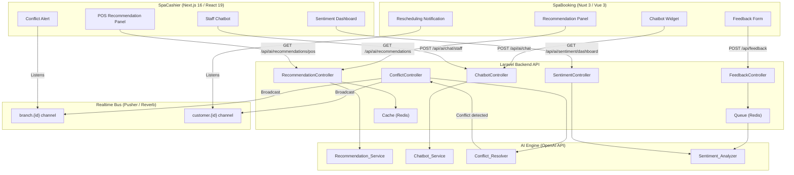

# Design Document: Spa AI Features

## Overview

This document describes the technical design for four AI-powered features across the two-app spa management system:

1. **Smart Treatment Recommendations** — personalized treatment suggestions in SpaBooking (customer-facing) and SpaCashier (POS upsell)
2. **Intelligent Booking Assistant (Chatbot)** — natural-language booking and operational query interface
3. **Session & Booking Conflict Resolution** — automated conflict detection with proactive rescheduling
4. **Customer Sentiment & Feedback Analysis** — post-session feedback collection with AI sentiment scoring and a manager dashboard

Both apps share a Laravel backend API. Real-time events flow through Pusher/Laravel Echo (using Laravel Reverb as the WebSocket server, as configured in SpaCashier). The AI workloads are delegated to an external LLM provider (OpenAI API) via a thin Laravel service layer.

---

## Architecture

### High-Level System Diagram



### Key Architectural Decisions

**OpenAI as AI Engine**: The Laravel backend proxies all AI requests to OpenAI (GPT-4o-mini for chat/recommendations, text-embedding-3-small for semantic similarity in recommendations, and a sentiment classification prompt for feedback). This keeps AI logic server-side, protects API keys, and allows model swapping without frontend changes.

**Redis for caching and queuing**: Recommendation results are cached per customer (24-hour TTL). Sentiment analysis jobs are queued via Laravel Horizon (Redis-backed) to decouple feedback submission from AI processing latency.

**Reverb as WebSocket server**: SpaCashier already uses Laravel Reverb (`broadcaster: 'reverb'`). SpaBooking uses the same Pusher-compatible client (`laravel-echo` + `pusher-js`). All real-time events flow through the same Reverb instance.

**Role-based channel authorization**: Private channels (`private-branch.{id}`, `private-customer.{id}`) are authorized by the Laravel backend using the authenticated user's role and branch assignment.

---

## Components and Interfaces

### 1. Smart Treatment Recommendations

#### Backend: `RecommendationService` (Laravel)

```
GET  /api/ai/recommendations          → customer-facing (SpaBooking)
GET  /api/ai/recommendations/pos      → staff-facing (SpaCashier)
POST /api/ai/recommendations/invalidate/{customerId}  → cache bust on new booking
```

The service:
1. Checks Redis cache for `rec:{customerId}:{branchId}` (TTL 24h).
2. On cache miss, fetches the customer's bookings from the last 90 days.
3. Calls `Recommendation_Service` (OpenAI) with booking history as context.
4. Filters out unavailable treatments at the branch.
5. Returns ranked list (max 5 for SpaBooking, max 3 for POS) with a ≤20-word rationale per item.
6. Falls back to globally popular treatments if AI is unavailable or history < 3 bookings.

#### SpaBooking: `useRecommendations` composable (Vue 3)

```typescript
// app/composables/useRecommendations.ts
const { recommendations, isLoading } = useRecommendations(customerId, branchId)
```

Renders a `<RecommendationPanel>` component in the catalog and booking flow pages.

#### SpaCashier: `useRecommendations` hook (React)

```typescript
// src/hooks/useRecommendations.ts
const { data, isLoading } = useRecommendations(customerId, branchId, 'pos')
```

Renders a `<RecommendationPanel>` component in the customer profile and POS sale views. Panel is hidden (not shown as error) when the service is unavailable.

---

### 2. Intelligent Booking Assistant (Chatbot)

#### Backend: `ChatbotController` (Laravel)

```
POST /api/ai/chat          → customer booking assistant (SpaBooking)
POST /api/ai/chat/staff    → staff operational query (SpaCashier)
```

**Customer chatbot flow**:
1. Receives message + session history (last 10 messages).
2. Sends to `Chatbot_Service` (OpenAI) with a system prompt defining the booking assistant persona and available treatments/branches.
3. If intent is complete (date, time, treatment, branch all extracted), returns `{ type: 'booking_intent', params: {...} }`.
4. If intent is incomplete, returns `{ type: 'clarification', missingField: 'date' | 'time' | 'treatment' | 'branch', message: '...' }`.

**Staff chatbot flow**:
1. Receives query + staff auth context (role, branch_id).
2. Classifies intent: `revenue_query | booking_query | staff_query | session_query`.
3. Executes the corresponding scoped data retrieval (filtered by branch and role).
4. Returns `{ type: 'data_response', value, period, branch, formattedAnswer }`.

#### SpaBooking: `ChatWidget` component (Vue 3)

- Persistent floating widget rendered in the root layout (`app/layouts/default.vue`).
- Visible only to authenticated customers.
- Maintains local conversation history (last 10 messages) in a Pinia store.
- Shows typing indicator (`isTyping` state) while awaiting response.
- On `booking_intent` response, navigates to `/checkout` with pre-populated query params.
- On service unavailability, shows fallback message with link to `/bookings`.

#### SpaCashier: `StaffChatPanel` component (React)

- Rendered in the dashboard layout sidebar.
- Visible only to authenticated staff.
- Shows typing indicator while awaiting response.
- On service unavailability, shows inline message.

---

### 3. Session & Booking Conflict Resolution

#### Backend: `ConflictResolverService` (Laravel)

Triggered by a `BookingObserver` on `created` and `updated` events.

```
POST /api/internal/conflicts/evaluate   → called by BookingObserver (internal)
GET  /api/conflicts                     → conflict history (manager only)
```

**Conflict detection logic**:
1. For the new/modified booking, query all bookings sharing the same `employee_id` (therapist) or `room_id` within the same time window `[start, end)`.
2. If overlap found, create a `Conflict` record and call `Conflict_Resolver` (OpenAI) to generate up to 3 alternative slots based on therapist/room availability.
3. If no same-day slots, look ahead up to 3 calendar days.
4. Broadcast `ConflictDetected` event to `private-branch.{branchId}` (for SpaCashier staff alert).
5. Broadcast `ReschedulingSuggestion` event to `private-customer.{customerId}` (for SpaBooking notification).

#### SpaCashier: `useConflictAlerts` hook (React)

```typescript
// src/hooks/useConflictAlerts.ts
// Listens on private-branch.{branchId} for ConflictDetected events
// Renders <ConflictAlertBanner> with conflicting booking details and alternative slots
```

#### SpaBooking: `useReschedulingNotifications` composable (Vue 3)

```typescript
// app/composables/useReschedulingNotifications.ts
// Listens on private-customer.{customerId} for ReschedulingSuggestion events
// Renders <ReschedulingModal> with conflict reason and slot options
// On slot selection: POST /api/bookings/{id}/reschedule
// On dismiss: POST /api/conflicts/{id}/dismiss (persists dismissal)
```

Persisted suggestions (for offline customers) are fetched on login via `GET /api/conflicts/pending`.

---

### 4. Customer Sentiment & Feedback Analysis

#### Backend: `FeedbackController` + `SentimentAnalysisJob` (Laravel)

```
POST /api/feedback                    → submit feedback
GET  /api/ai/sentiment/dashboard      → manager dashboard data
GET  /api/ai/sentiment/summary        → AI-generated summary (last 50 records)
```

**Feedback submission flow**:
1. Validate: session exists, within 48h window, no duplicate for this customer+session.
2. Persist `Feedback` record (rating, comment, session_id, customer_id).
3. Dispatch `SentimentAnalysisJob` to Redis queue.
4. Return 201 immediately (non-blocking).

**SentimentAnalysisJob**:
1. If comment is empty → set `sentiment_score = 0.0`, `sentiment_label = 'neutral'`, skip AI call.
2. Otherwise, call `Sentiment_Analyzer` (OpenAI) with the comment.
3. Parse response: score ∈ [-1.0, 1.0], label ∈ {positive, neutral, negative}.
4. Update `Feedback` record.
5. Broadcast `FeedbackAnalyzed` event to `private-branch.{branchId}` for real-time dashboard update.
6. On failure: retry up to 5 times at 60-second intervals; after 5 failures, set `analysis_status = 'analysis_failed'`.

#### SpaCashier: `SentimentDashboard` page (React)

- Route: `/dashboard/sentiment` (manager role only, enforced by middleware).
- Fetches aggregated metrics: average score, label distribution, time-series data.
- Filter controls: branch, treatment, therapist, time period (7/30/90 days).
- Displays AI summary (≤150 words) and top-5 most recent negative feedback records.
- Listens on `private-branch.{branchId}` for `FeedbackAnalyzed` events to update metrics in real time via React Query cache invalidation.

---

## Data Models

### New Database Tables (Laravel Migrations)

#### `ai_recommendations` (cache metadata — optional, Redis is primary)
```
id, customer_id, branch_id, recommendations (JSON), generated_at, expires_at
```

#### `chat_sessions`
```
id, user_id, user_type (customer|staff), messages (JSON, last 10), created_at, updated_at
```

#### `conflicts`
```
id
booking_id          (FK → sessions/bookings)
conflicting_booking_id
conflict_type       ENUM('therapist', 'room')
detection_timestamp
resolution_status   ENUM('pending', 'accepted', 'dismissed', 'expired')
resolution_action   ENUM('accepted', 'dismissed') NULLABLE
resolution_timestamp NULLABLE
alternative_slots   JSON  (array of up to 3 slot objects)
branch_id           (FK → branches)
```

#### `feedbacks`
```
id
session_id          (FK → sessions)
customer_id         (FK → customers)
rating              TINYINT (1–5)
comment             TEXT (max 1000 chars)
sentiment_score     DECIMAL(4,3) NULLABLE  (range -1.000 to 1.000)
sentiment_label     ENUM('positive', 'neutral', 'negative') NULLABLE
analysis_status     ENUM('pending', 'completed', 'analysis_failed') DEFAULT 'pending'
analysis_attempts   TINYINT DEFAULT 0
submitted_at        TIMESTAMP
analyzed_at         TIMESTAMP NULLABLE
```

### New TypeScript Types (SpaCashier `src/lib/types.ts` additions)

```typescript
// Recommendation
export type TreatmentRecommendation = {
  treatment: Treatment;
  rank: number;
  rationale: string; // max 20 words
};

// Chat
export type ChatMessage = {
  role: 'user' | 'assistant';
  content: string;
  timestamp: string;
};

export type ChatResponse =
  | { type: 'booking_intent'; params: BookingIntentParams }
  | { type: 'clarification'; missingField: string; message: string }
  | { type: 'data_response'; value: unknown; period: string; branch: string; formattedAnswer: string }
  | { type: 'error'; message: string };

export type BookingIntentParams = {
  date: string;
  time: string;
  treatmentId: string;
  branchId: string;
};

// Conflict
export type ConflictRecord = {
  id: number;
  bookingId: number;
  conflictingBookingId: number;
  conflictType: 'therapist' | 'room';
  detectionTimestamp: string;
  resolutionStatus: 'pending' | 'accepted' | 'dismissed' | 'expired';
  resolutionAction: 'accepted' | 'dismissed' | null;
  resolutionTimestamp: string | null;
  alternativeSlots: AlternativeSlot[];
  branchId: string;
};

export type AlternativeSlot = {
  date: string;
  startTime: string;
  endTime: string;
  therapistId: number;
  roomId: string;
};

// Feedback & Sentiment
export type Feedback = {
  id: number;
  sessionId: number;
  customerId: number;
  rating: 1 | 2 | 3 | 4 | 5;
  comment: string;
  sentimentScore: number | null;
  sentimentLabel: 'positive' | 'neutral' | 'negative' | null;
  analysisStatus: 'pending' | 'completed' | 'analysis_failed';
  submittedAt: string;
  analyzedAt: string | null;
};

export type SentimentDashboardData = {
  averageScore: number;
  labelDistribution: { positive: number; neutral: number; negative: number };
  timeSeries: { date: string; averageScore: number }[];
  aiSummary: string; // max 150 words
  recentNegative: FeedbackSummary[]; // max 5
};

export type FeedbackSummary = {
  customerFirstName: string;
  treatmentName: string;
  sentimentScore: number;
  comment: string;
};
```

### New Vue 3 Types (SpaBooking `types/` additions)

Equivalent interfaces for `TreatmentRecommendation`, `ChatMessage`, `ChatResponse`, `BookingIntentParams`, `AlternativeSlot`, and `Feedback` in TypeScript.

---

## Correctness Properties

*A property is a characteristic or behavior that should hold true across all valid executions of a system — essentially, a formal statement about what the system should do. Properties serve as the bridge between human-readable specifications and machine-verifiable correctness guarantees.*

### Property 1: Recommendation list size is within context bounds

*For any* customer and any recommendation request context (SpaBooking or POS), the returned recommendation list length is greater than 0 and at most the context-specific maximum (5 for SpaBooking, 3 for POS).

**Validates: Requirements 1.1, 2.1**

---

### Property 2: Recommendations exclude unavailable treatments

*For any* recommendation result and any branch, no returned treatment has an availability status of unavailable or out-of-service at that branch.

**Validates: Requirements 1.6**

---

### Property 3: Recommendation recency window

*For any* customer's booking history, adding a booking record with a date older than 90 days should not change the recommendation output compared to the same history without that old booking.

**Validates: Requirements 3.1**

---

### Property 4: Rationale word count invariant

*For any* recommendation item returned by the Recommendation_Service, the AI-generated rationale field contains at most 20 words.

**Validates: Requirements 2.4**

---

### Property 5: Chatbot intent extraction completeness

*For any* customer message that contains all four required booking parameters (date, time, treatment, branch), the Chatbot_Service returns a `booking_intent` response with all four fields populated and non-null.

**Validates: Requirements 4.2, 4.3**

---

### Property 6: Chatbot clarification identifies missing parameter

*For any* customer message that is missing one or more required booking parameters, the Chatbot_Service returns a `clarification` response whose `missingField` value names one of the absent parameters.

**Validates: Requirements 4.4**

---

### Property 7: Chatbot context retention across 10 messages

*For any* conversation of N messages where 1 ≤ N ≤ 10, the Chatbot_Service response to the Nth message can correctly reference information provided in the first message of the same session.

**Validates: Requirements 4.7**

---

### Property 8: Staff chatbot intent classification is exhaustive

*For any* staff natural-language query, the Chatbot_Service classifies the intent as exactly one of: `revenue_query`, `booking_query`, `staff_query`, or `session_query`.

**Validates: Requirements 5.2**

---

### Property 9: Staff chatbot response structure completeness

*For any* staff query that produces a data response, the response object contains non-null values for `value`, `period`, and `branch`.

**Validates: Requirements 5.4**

---

### Property 10: Staff chatbot authorization invariant

*For any* staff member with role R and branch assignment B, all data items returned by the Chatbot_Service belong to branch B and fall within the access scope permitted for role R.

**Validates: Requirements 5.5**

---

### Property 11: Conflict detection for overlapping bookings

*For any* two bookings that share the same therapist or the same room and whose time windows overlap (i.e., `booking1.start < booking2.end AND booking2.start < booking1.end`), the Conflict_Resolver detects and records a conflict.

**Validates: Requirements 6.1, 6.2**

---

### Property 12: Alternative slot count is bounded

*For any* detected conflict, the number of generated alternative slots is between 0 and 3 (inclusive).

**Validates: Requirements 6.6**

---

### Property 13: Conflict alert contains all required fields

*For any* conflict event payload received by SpaCashier, the rendered conflict alert displays the conflicting booking identifiers, the affected therapist or room identifier, and the overlapping time window.

**Validates: Requirements 6.5**

---

### Property 14: Rescheduling notification contains conflict reason and slots

*For any* rescheduling suggestion event payload received by SpaBooking, the rendered notification displays the conflict reason and all available alternative slots from the payload.

**Validates: Requirements 7.2**

---

### Property 15: Reschedule selection round-trip

*For any* alternative slot selected by a customer from the rescheduling notification, the reschedule API is called with the correct slot parameters and a booking confirmation is displayed to the customer.

**Validates: Requirements 7.3**

---

### Property 16: Dismissed suggestion does not reappear

*For any* rescheduling suggestion that a customer has dismissed, re-rendering the notification list for that customer should not include that suggestion.

**Validates: Requirements 7.4**

---

### Property 17: Persisted suggestion appears on next login

*For any* rescheduling suggestion persisted while a customer was offline, the suggestion appears in the customer's notification list upon their next authenticated session.

**Validates: Requirements 7.6**

---

### Property 18: Conflict record completeness

*For any* persisted conflict record, the fields `booking_id`, `conflicting_booking_id`, `conflict_type`, `detection_timestamp`, and `resolution_status` are all non-null.

**Validates: Requirements 8.1**

---

### Property 19: Conflict record resolution update

*For any* resolution action (accept or dismiss) taken by a customer, the corresponding conflict record's `resolution_action` and `resolution_timestamp` fields are updated to reflect the action.

**Validates: Requirements 8.2**

---

### Property 20: Conflict history scoped to manager's branch

*For any* manager viewing the conflict history, all displayed conflict records have a `branch_id` matching the manager's assigned branch.

**Validates: Requirements 8.3**

---

### Property 21: Feedback submission payload completeness

*For any* feedback form submission, the API request payload contains non-null values for `rating`, `comment`, `session_id`, and `customer_id`.

**Validates: Requirements 9.3**

---

### Property 22: Feedback time window enforcement

*For any* feedback submission at time T for a session completed at time S, the submission is accepted if and only if `T − S ≤ 48 hours`.

**Validates: Requirements 9.4, 9.5**

---

### Property 23: One feedback per customer per session

*For any* customer-session pair, submitting a second feedback record results in the Backend_API rejecting the duplicate submission, leaving exactly one feedback record for that pair.

**Validates: Requirements 9.6, 9.7**

---

### Property 24: Sentiment output validity

*For any* non-empty feedback comment processed by the Sentiment_Analyzer, the resulting `sentiment_score` is in the range [-1.0, 1.0] and the `sentiment_label` is one of `positive`, `neutral`, or `negative`.

**Validates: Requirements 10.1, 10.3**

---

### Property 25: Sentiment retry exhaustion

*For any* queued sentiment analysis job that fails on every attempt, after exactly 5 failed attempts the feedback record's `analysis_status` is set to `analysis_failed`.

**Validates: Requirements 10.6**

---

### Property 26: Sentiment dashboard access control

*For any* staff member whose role is not `manager`, attempting to access the sentiment dashboard route returns an authorization error (HTTP 403 or redirect to unauthorized page).

**Validates: Requirements 11.1**

---

### Property 27: Sentiment dashboard filter correctness

*For any* combination of branch, treatment, and therapist filters applied to the sentiment dashboard, all feedback records included in the displayed metrics match every active filter criterion.

**Validates: Requirements 11.3**

---

### Property 28: AI summary word count invariant

*For any* AI-generated sentiment summary produced by the Sentiment_Analyzer, the word count of the summary is at most 150.

**Validates: Requirements 11.5**

---

### Property 29: Recent negative feedback correctness

*For any* filter applied to the sentiment dashboard, the displayed negative feedback records all have `sentiment_label = 'negative'` and are the 5 most recent by `submitted_at` timestamp among all negative records matching the filter.

**Validates: Requirements 11.6**

---

## Error Handling

### AI Service Unavailability

| Feature | Failure Mode | Behavior |
|---|---|---|
| Recommendations (SpaBooking) | OpenAI timeout / 5xx | Return globally popular treatments; no error shown to customer |
| Recommendations (POS) | OpenAI timeout / 5xx | Hide recommendation panel silently |
| Chatbot (SpaBooking) | OpenAI timeout / 5xx | Show "assistant temporarily unavailable" + link to manual booking |
| Chatbot (SpaCashier) | OpenAI timeout / 5xx | Show "assistant temporarily unavailable" inline message |
| Conflict Resolver | OpenAI timeout / 5xx | Log error; conflict record created with `alternative_slots = []`; staff alert still broadcast |
| Sentiment Analyzer | OpenAI timeout / 5xx | Queue job for retry; feedback submission returns 201 immediately |

### Real-time Channel Failures

If the Reverb WebSocket connection drops, both apps fall back to polling:
- SpaCashier: React Query refetch interval of 30 seconds for conflict and sentiment data.
- SpaBooking: Nuxt `useAsyncData` with a 30-second refresh interval for pending rescheduling suggestions.

### Validation Errors

- Feedback submitted outside 48-hour window → HTTP 422 with `error: 'feedback_window_closed'`.
- Duplicate feedback submission → HTTP 409 with `error: 'feedback_already_submitted'`.
- Staff chatbot query outside authorization scope → HTTP 200 with `type: 'authorization_error'` in response body (not HTTP 403, to avoid breaking the chat UI).

### Queue Failures

Laravel Horizon monitors the `sentiment-analysis` queue. After 5 failed attempts (60-second intervals), the job is marked as failed and the feedback record's `analysis_status` is set to `analysis_failed`. A Horizon alert is triggered for operator review.

---

## Testing Strategy

### Dual Testing Approach

Both unit/property tests and integration tests are used. Unit tests cover specific examples and edge cases. Property-based tests verify universal invariants across generated inputs.

### Property-Based Testing

The feature involves pure functions (recommendation ranking, conflict overlap detection, sentiment score validation, chatbot response parsing) that are well-suited for property-based testing.

**Library choices**:
- **SpaCashier (TypeScript/React)**: [`fast-check`](https://github.com/dubzzz/fast-check)
- **SpaBooking (TypeScript/Vue 3)**: [`fast-check`](https://github.com/dubzzz/fast-check)
- **Laravel backend (PHP)**: [`eris`](https://github.com/giorgiosironi/eris) or PHPUnit data providers for parameterized tests

Each property test runs a minimum of **100 iterations**.

Tag format for each test:
```
// Feature: spa-ai-features, Property {N}: {property_text}
```

**Properties mapped to tests**:

| Property | Test file | What is generated |
|---|---|---|
| P1 – Recommendation list size | `recommendations.property.test.ts` | Random customer histories, context type |
| P2 – Exclude unavailable treatments | `recommendations.property.test.ts` | Random treatment availability maps |
| P3 – Recency window | `recommendations.property.test.ts` | Booking records with random dates |
| P4 – Rationale word count | `recommendations.property.test.ts` | Random recommendation responses |
| P5 – Intent extraction completeness | `chatbot.property.test.ts` | Messages with all 4 params present |
| P6 – Clarification identifies missing param | `chatbot.property.test.ts` | Messages with 1–3 params missing |
| P7 – Context retention | `chatbot.property.test.ts` | Conversation histories of length 1–10 |
| P8 – Staff intent classification exhaustive | `chatbot.property.test.ts` | Random staff queries |
| P9 – Staff response structure | `chatbot.property.test.ts` | Random data query responses |
| P10 – Staff authorization invariant | `chatbot.property.test.ts` | Random staff roles and branch assignments |
| P11 – Conflict detection | `conflict.property.test.ts` | Booking pairs with overlapping/non-overlapping windows |
| P12 – Alternative slot count | `conflict.property.test.ts` | Random availability calendars |
| P13 – Conflict alert fields | `conflict.property.test.ts` | Random conflict event payloads |
| P14 – Rescheduling notification fields | `conflict.property.test.ts` | Random rescheduling event payloads |
| P15 – Reschedule round-trip | `conflict.property.test.ts` | Random slot selections |
| P16 – Dismissed suggestion idempotence | `conflict.property.test.ts` | Random suggestion lists with dismissals |
| P17 – Persisted suggestion on login | `conflict.property.test.ts` | Random offline/online scenarios |
| P18 – Conflict record completeness | `conflict.property.test.ts` | Random conflict creation events |
| P19 – Conflict record resolution update | `conflict.property.test.ts` | Random resolution actions |
| P20 – Conflict history branch scope | `conflict.property.test.ts` | Random manager/branch combinations |
| P21 – Feedback payload completeness | `feedback.property.test.ts` | Random feedback form submissions |
| P22 – Feedback time window | `feedback.property.test.ts` | Random submission timestamps relative to session completion |
| P23 – One feedback per session | `feedback.property.test.ts` | Duplicate submission attempts |
| P24 – Sentiment output validity | `sentiment.property.test.ts` | Random comment strings |
| P25 – Sentiment retry exhaustion | `sentiment.property.test.ts` | Job failure sequences |
| P26 – Dashboard access control | `sentiment.property.test.ts` | Random staff roles |
| P27 – Dashboard filter correctness | `sentiment.property.test.ts` | Random filter combinations and feedback datasets |
| P28 – AI summary word count | `sentiment.property.test.ts` | Random summary strings |
| P29 – Recent negative feedback correctness | `sentiment.property.test.ts` | Random feedback datasets with mixed labels |

### Unit Tests

- Recommendation fallback logic (service unavailable, < 3 bookings).
- Chatbot service unavailability fallback (SpaBooking and SpaCashier).
- Empty comment → sentiment_score=0.0, sentiment_label='neutral', no AI call.
- Feedback form validation (rating range, comment max length).
- Conflict alert rendering with all required fields.
- Sentiment dashboard renders all three required components (average score, distribution, time-series).

### Integration Tests

- Recommendation response time ≤ 2 seconds under realistic load.
- Chatbot response time ≤ 5 seconds.
- Conflict evaluation completes within 3 seconds of booking event.
- Conflict event broadcast reaches SpaCashier channel.
- Rescheduling suggestion delivered to SpaBooking within 10 seconds.
- Feedback prompt event triggered on session completion.
- Sentiment analysis job queued and processed end-to-end.
- Dashboard filter update renders within 3 seconds.
- Real-time dashboard update on new `FeedbackAnalyzed` event.
